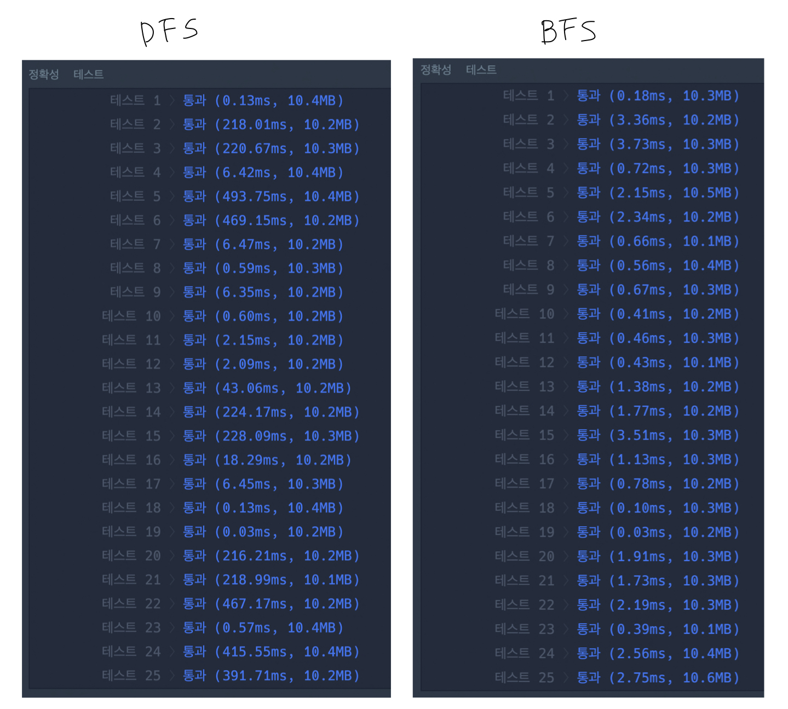

### 124나라의 숫자

### 조이스틱  
  a. 좌우 방향으로 움직이는 횟수를 최소화해야 함  
  b. 그래프 이용해서 최단거리 탐색 using DFS  
  c. cut edge : 트리의 모든 가지를 전개하기엔 시간이 부족해!  
  e.g., [A,B,A,B,A,A,A,A,A,B,A]

### 문자열 압축  
  a. 최대 압축 단위는 전체 문자열 길이의 절반  
  e.g., 'abcabcdede' -> '2abcdede'  
  

### 올바른 괄호

### 양궁대회 (DFS)
1. `get_score` 함수
  - 과녁 `i`에 라이언이 더 많이 쏜 경우에는 `10-i`점만큼 라이언한테 점수 부여
  - 과녁 `i`에 어피치가 더 많이 쏜 경우에는 `10-i`점만큼 어피치한테 점수 부여 i.e., 라이언은 점수 뺏김
  - 이렇게 라이언과 어피치의 `점수 차이`를 계산하는 함수
2. DFS(`I`, `L`, `S`)
  - 라이언이 양궁을 쏘는 시점에서 시작함 i.e., 라이언은 현재 `n`발 쏠 수 있음.
  - 라이언이 과녁 `i`에 몇 발 쏠 건지는 10점짜리 과녁에서부터 체크할 것임. 그래서 DFS의 `I`가 10에서 시작해서 -1까지 움직이는 것.
  - 만약 라이언이 10점짜리 과녁에 화살 2개를 쐈다면?
    * `S[10]=2`로 리스트 `S`의 원소 업데이트
    * 이제 9점짜리 과녁에 화살을 몇 개 쏠지 정해야 하므로 `I=9`
    * 이제 총 `n`발 중에 `n-2`발의 화살만 남았으므로 `L-=2`
  - 만약 3점짜리 과녁까지 체크하고 나니 벌써 `n`발의 화살을 모두 사용했다면? 리스트 `S`와 어피치의 스코어를 비교!(`get_score` 함수)
  - 만약 -1점까지 체크했는데도 화살이 남았다면? 비교하려는 경우가 아니므로 그냥 `return`
3. 최솟값 계산
  - `n`발의 화살을 모두 사용한 뒤, 리스트 `S`와 어피치의 스코어를 비교하여 `점수 차이`가 기존 maximum value보다 크다면 maximum value 업데이트
  - 그런데! 라이언이 절대 이길 수 없는 경우라서 `점수 차이`가 0보다 작거나 같다면 maximum value를 업데이트 하지 않고 최종 정답으로 `-1` 반환

### 양궁대회 (BFS)
1. queue에 들어가는 원소는 (`i번째 과녁`,`현재 점수`) i.e., 초깃값은 (`0`, `[0]*11`)
2. queue.popleft()
  - 만약 `현재 점수`의 합이 `n`과 같다면?
    * 쏠 수 있는 화살을 다 쏜거니까 라이언과 어피치 점수 계산 가능
    * 라이언과 어피치의 점수를 계산했을 때, 서로의 점수 차이가 기존 maximum value보다 크면 maximum value 업데이트
  - 만약 `현재 점수`의 합이 `n`보다 크다면?
    * 쏠 수 있는 화살을 넘어버렸으니까 더이상 queue에 현재상태를 append하면 안돼
  - 만약 `현재 점수`의 합이 `n`보다 작은데, 이미 10번째 과녁에 왔다면?
    * 모든 과녁을 검토했으므로 더이상 queue에 현재상태를 append하면 안돼
  - 만약 `현재 점수`의 합이 `n`보다 작은데, 아직 모든 과녁을 검토하지 않았다면?
    * 경우 1 : 해당 과녁에 한 발도 쏘지 않음 i.e., (`i+1`,`현재 점수`) append
    * 경우 2 : 해당 과녁에 어피치보다 딱 한 발 더 쏘기 i.e., (`i+1`,`어피치 i번째 점수에 +1한 리스트`) append
    * 왜 어피치보다 딱 한 발 더 쏴야하냐고??? 나도 몰라.. 같이 토의해줘
3. queue에 더 이상 원소가 들어오지 않아서 `while`문이 끝남
  - 점수 차이가 maximum value일 때의 라이언의 스코어(queue의 각 원소 중 두번째 값) 리스트 반환  

c.f., The performance of BFS is better than that of DFS.

### n^2 배열 자르기

### 모음사전
첫 글자가 'A'로 시작한다면
- 단어 길이 = 1 [A] $\rightarrow 5^0$
- 단어 길이 = 2 [A, ?] $\rightarrow 5^1$
- 단어 길이 = 3 [A, ?, ?] $\rightarrow 5^2$
- 단어 길이 = 4 [A, ?, ?, ?] $\rightarrow 5^3$
- 단어 길이 = 5 [A, ?, ?, ?, ?] $\rightarrow 5^4$
$$\therefore \sum_{i=0}^{4} 5^i = \frac{1(5^5-1)}{5-1}$$

두번째 글자가 'E'로 시작한다면
- 단어 길이 = 2 [A, E] $\rightarrow 5^0$
- 단어 길이 = 3 [A, E, ?] $\rightarrow 5^1$
- 단어 길이 = 4 [A, E, ?, ?] $\rightarrow 5^2$
- 단어 길이 = 5 [A, E, ?, ?, ?] $\rightarrow 5^3$
$$\therefore \sum_{i=0}^{3} 5^i = \frac{1(5^4-1)}{5-1}$$

e.g., 'EEIO'
- E : 첫 번째 글자 기준 'A'로 시작하는 단어들을 다 지나쳐야 함
$$\sum_{i=0}^{4} 5^i$$
- E : 두 번째 글자 기준 'A'로 시작하는 단어들을 다 지나쳐야 함
$$\sum_{i=0}^{3} 5^i$$
- I : 세 번째 글자 기준 'A'+'E' 로 시작하는 단어들을 다 지나쳐야 함
$$\sum_{i=0}^{2} 5^i + \sum_{i=0}^{2} 5^i$$
- O : 네 번째 글자 기준 'A'+'E'+'I' 로 시작하는 단어들을 다 지나쳐야 함
$$\sum_{i=0}^{1} 5^i + \sum_{i=0}^{1} 5^i + \sum_{i=0}^{1} 5^i$$

### 카펫

### 순위 검색

### 경쟁적 전염
1. BFS(`type`, `location_x`, `lcation_y`, `seconds`)
2. 바이러스의 `type`을 기준으로 정렬하여 queue에 넣어줌. 그래야 `type` 순서대로 바이러스 증식 가능
3. BFS
    - dq.popleft()
    - 만약 `seconds`가 목표 시간 `S`에 도달하면, while문을 멈추고 graph\[`X`]\[`Y`] 값 출력
    - 아직 목표 시간 `S`가 아니면, 상/하/좌/우 중 아직 바이러스가 증식되지 않은 곳에 증식!
    - dq.append(`동일한 type`, `새로운 location_x`, `새로운 location_y`, `seconds + 1`)

### 인구 이동
1. while문 안에서 연합 국가가 생성되면 BFS 수행. 연합 국가가 생성되지 않으면 while문 break
2. BFS 시작하기 전에
    - 국가 중복 탐색을 방지하기 위한 visit matrix 생성
    - 연합 국가 생성 여부를 판단하기 위한 boolean 변수 생성 (is_moved = False)
3. BFS 시작
    - 모든 국가를 탐색하다가 아직 방문하지 않은 국가가 발견되는 순간 BFS 시작!
    - dq 생성하고 현재 국가 좌표 append
    - 현재 국가 좌표 방문 처리
    - union list 생성 : 연합 국가 좌표들 저장
    - cnt 변수 생성 : 총 이동 인구 수 저장
4. BFS(`now_x`, `now_y`)
    - dq.popleft()
    - 현재 좌표 기준 연합 국가 찾기 : 상하좌우 중 `L`<=difference<=`R`이면 연합 국가에 해당!
    - dq.append((`new_x`, `new_y`))
    - union.append((`new_x`, `new_y`))
    - cnt += graph\[`new_x`]\[`new_y`]
5. BFS가 끝나면 연합 국가들 인구 이동시키기
    - graph\[`union_x`]\[`union_y`] = int(cnt/len(union))
    - is_moved = True
    - answer += 1
6. BFS 다 끝났는데, is_moved = False이면? 더 이상 연합 국가가 생성되지 않음을 의미하므로 while문 break!
