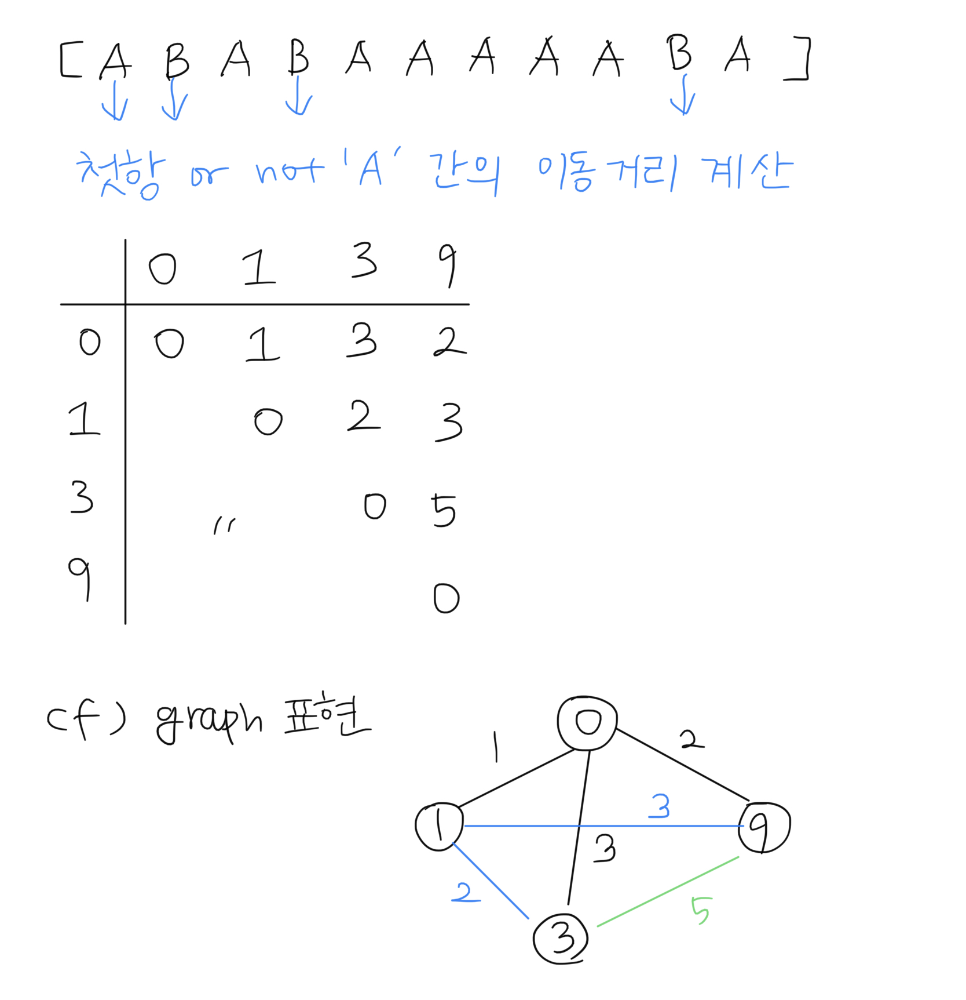
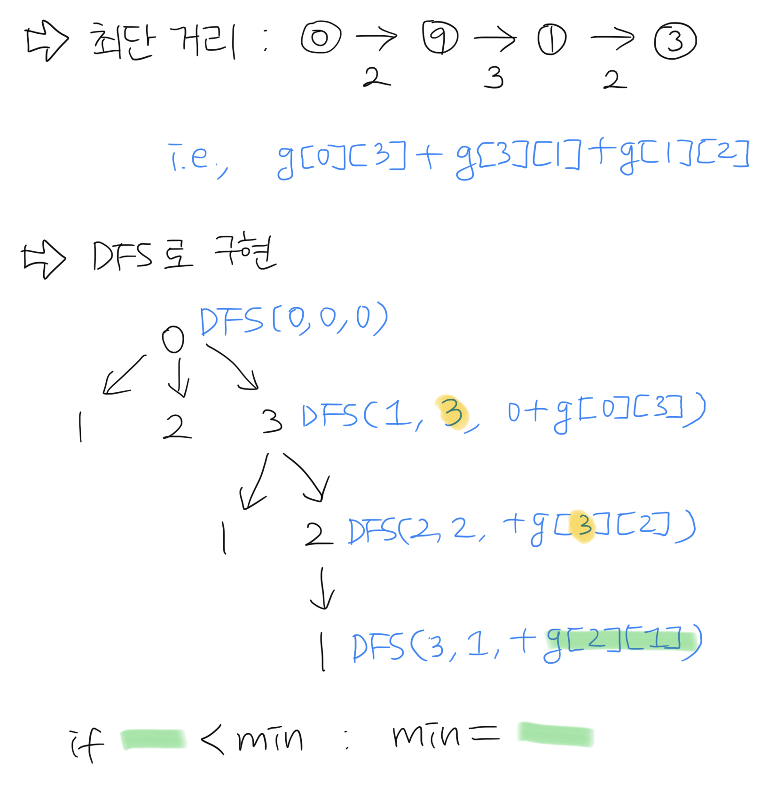
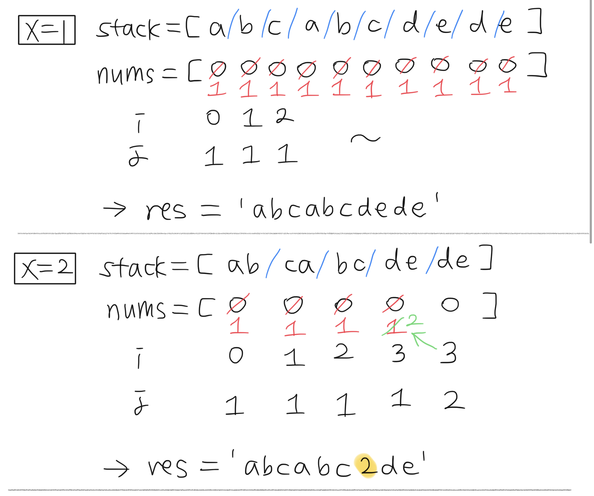
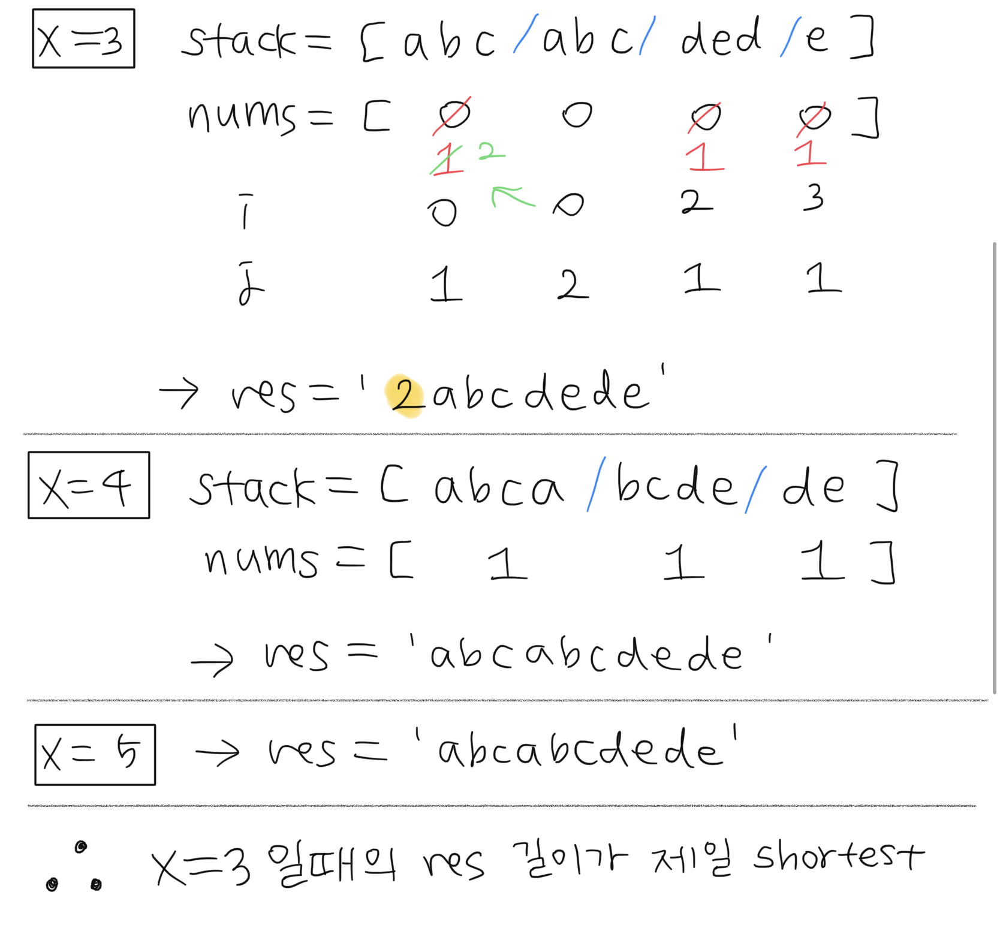
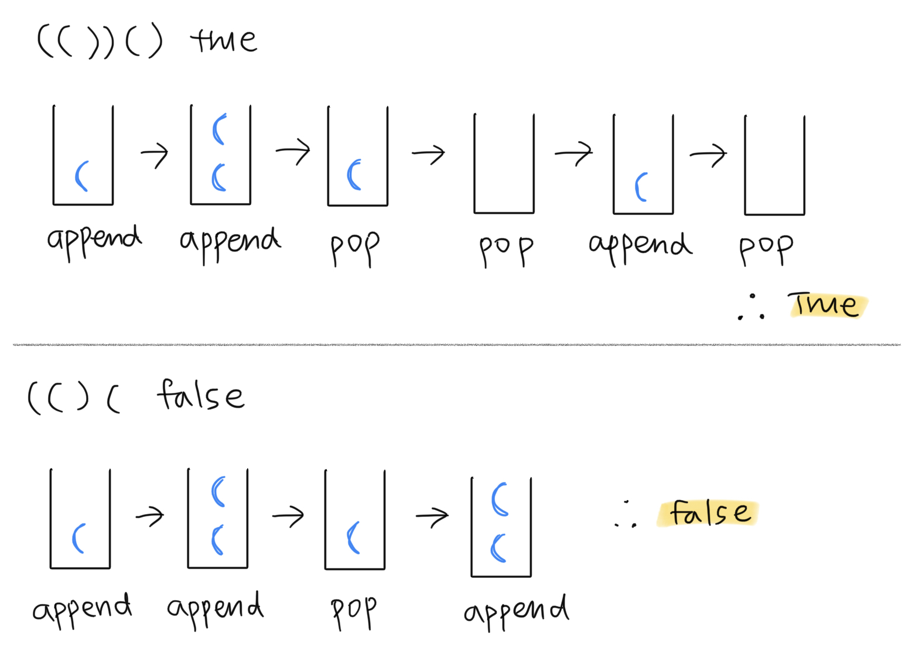
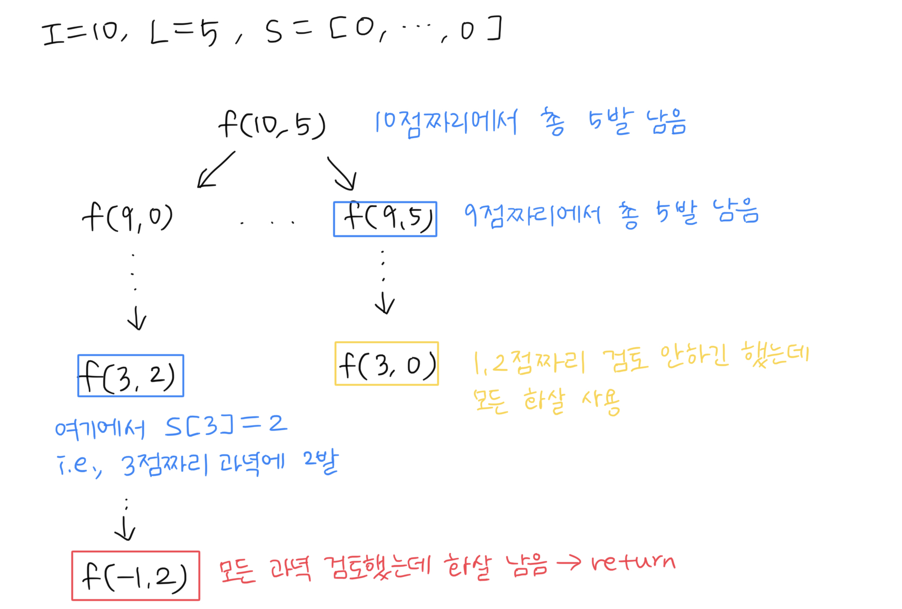
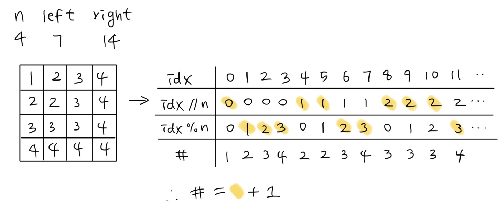
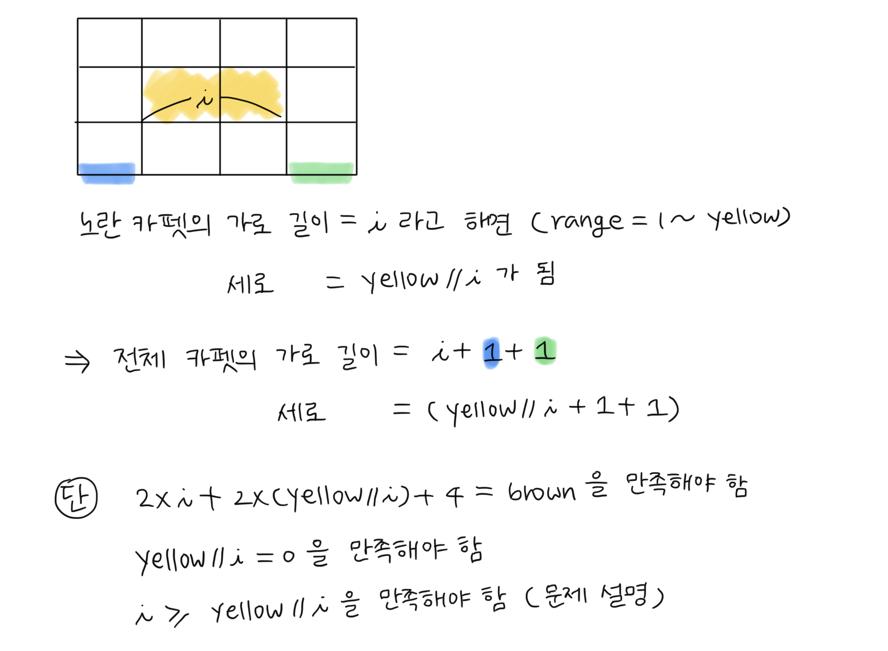
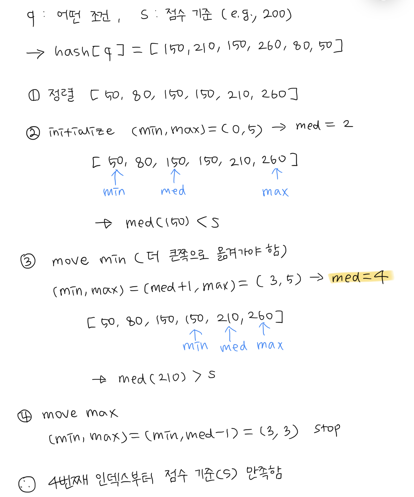

### 124나라의 숫자

### 조이스틱  
  a. 좌우 방향으로 움직이는 횟수를 최소화해야 함  
  b. 그래프 이용해서 최단거리 탐색 using DFS  
  c. cut edge : 트리의 모든 가지를 전개하기엔 시간이 부족해!  
  e.g., [A,B,A,B,A,A,A,A,A,B,A]

### 문자열 압축  
  a. 최대 압축 단위는 전체 문자열 길이의 절반  
  e.g., 'abcabcdede' -> '2abcdede'  
  

### 올바른 괄호

### 양궁대회 (DFS)

### n^2 배열 자르기

### 모음사전
첫 글자가 'A'로 시작한다면
- 단어 길이 = 1 [A] $\rightarrow 5^0$
- 단어 길이 = 2 [A, ?] $\rightarrow 5^1$
- 단어 길이 = 3 [A, ?, ?] $\rightarrow 5^2$
- 단어 길이 = 4 [A, ?, ?, ?] $\rightarrow 5^3$
- 단어 길이 = 5 [A, ?, ?, ?, ?] $\rightarrow 5^4$
$$\therefore \sum_{i=0}^{4} 5^i = \frac{1(5^5-1)}{5-1}$$

두번째 글자가 'E'로 시작한다면
- 단어 길이 = 2 [A, E] $\rightarrow 5^0$
- 단어 길이 = 3 [A, E, ?] $\rightarrow 5^1$
- 단어 길이 = 4 [A, E, ?, ?] $\rightarrow 5^2$
- 단어 길이 = 5 [A, E, ?, ?, ?] $\rightarrow 5^3$
$$\therefore \sum_{i=0}^{3} 5^i = \frac{1(5^4-1)}{5-1}$$

e.g., 'EEIO'
- E : 첫 번째 글자 기준 'A'로 시작하는 단어들을 다 지나쳐야 함
$$\sum_{i=0}^{4} 5^i$$
- E : 두 번째 글자 기준 'A'로 시작하는 단어들을 다 지나쳐야 함
$$\sum_{i=0}^{3} 5^i$$
- I : 세 번째 글자 기준 'A'+'E' 로 시작하는 단어들을 다 지나쳐야 함
$$\sum_{i=0}^{2} 5^i + \sum_{i=0}^{2} 5^i$$
- O : 네 번째 글자 기준 'A'+'E'+'I' 로 시작하는 단어들을 다 지나쳐야 함
$$\sum_{i=0}^{1} 5^i + \sum_{i=0}^{1} 5^i + \sum_{i=0}^{1} 5^i$$

### 카펫

### 순위 검색

