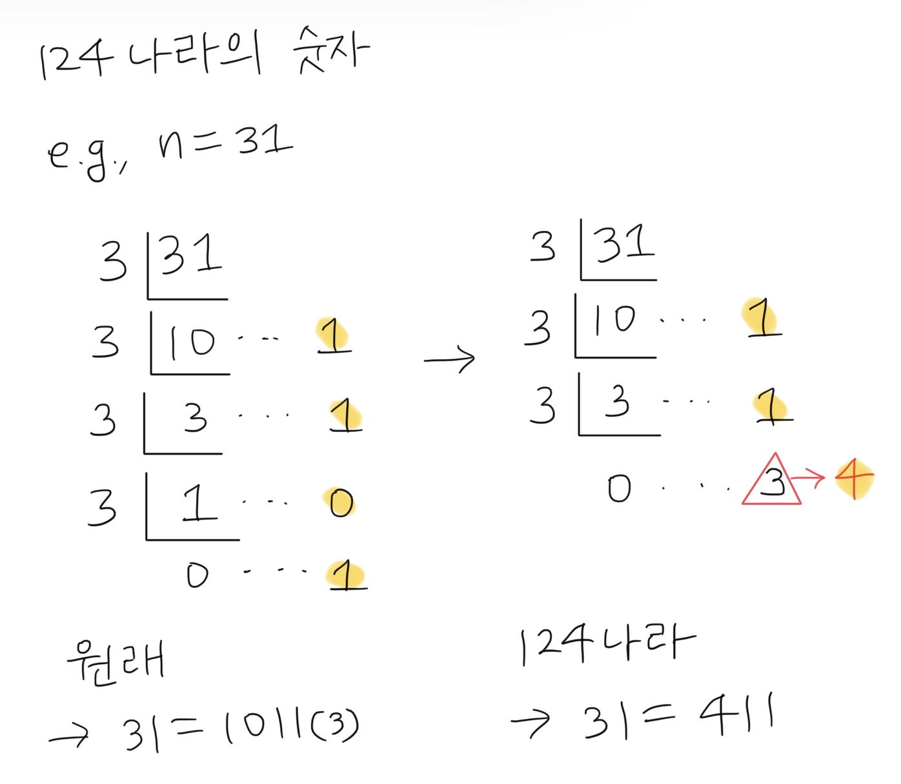

### 124나라의 숫자 원리

### 조이스틱  
  a. 좌우 방향으로 움직이는 횟수를 최소화해야 함  
  b. 그래프 이용해서 최단거리 탐색 using DFS  
  c. cut edge : 트리의 모든 가지를 전개하기엔 시간이 부족해!  
  e.g., [A,B,A,B,A,A,A,A,A,B,A]

### 문자열 압축  
  a. 최대 압축 단위는 전체 문자열 길이의 절반  
  e.g., 'abcabcdede' -> '2abcdede'  
  

### 올바른 괄호

### 양궁대회 (DFS)

### n^2 배열 자르기

